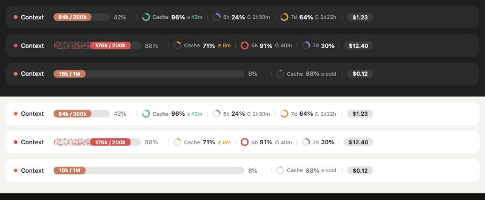

# usage-band

A Claude Code mod that puts your session's usage in one band above the prompt:

- **Context**: how full the context window is, with tokens used and the window size
- **Cache**: the prompt cache hit rate of the last reply, plus a countdown until the cache goes cold
- **5h / 7d**: subscription rate-limit windows, with time until reset
- **Cost**: what the session has cost so far



The desktop Code tab draws it as a single SVG row: a dithered context bar, rings for the cache and the limits, and a cost pill. It follows light and dark mode and respects reduced motion. A terminal gets a text version with the same figures.

Colours change as you approach a limit: amber from 60%, red from 85%. The cache ring drains as the cache ages and turns amber when less than a fifth of its lifetime is left.

## Install

At the prompt of a Claude Code terminal session:

```
/plugin install usage-band --marketplace was865/usage-band
```

Answer `y` to add the marketplace, then pick the user scope. New sessions show the band; it also works in the desktop app's Code tab.

## Options

| Option | Values | Default | What it does |
| --- | --- | --- | --- |
| `cacheTtl` | `1h`, `5m` | `1h` | How long the prompt cache stays warm. The countdown starts when the last reply finished. |

Claude Code does not expose the cache's real expiry time, so the countdown is an estimate. Set `cacheTtl` to match your account (`/plugin` → usage-band → configure).

The hit rate counts the main conversation only; subagents are not included. All figures come from Claude Code's own session data, so the mod makes no extra API calls and costs no tokens.

## Develop

```
claude plugin validate .
claude plugin test .
```
